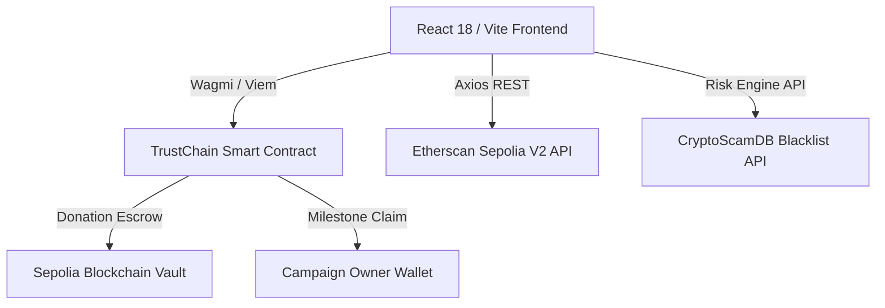

# 🛡️ TrustChain

> **Decentralized & Transparent Crowdfunding Platform with Automated Wallet Risk Audit**

[](https://trust-chain-fyp.vercel.app)
[](https://sepolia.etherscan.io/address/0x188bE06aC1C1B69f5715885A58b28BE0cf32A17f)
[](https://soliditylang.org/)
[](https://reactjs.org/)

---

## 📌 Project Overview

Traditional crowdfunding platforms often suffer from a lack of financial transparency, high intermediary fees, and vulnerability to fraudulent campaigns ("rug pulls"). **TrustChain** solves this by combining **Ethereum Smart Contract Escrow** with an **Automated Wallet Risk Scoring Engine**.

Donations are held in a secure, non-reentrant smart contract vault rather than transferred directly to personal accounts. Campaign creators can disburse funds transparently in milestones, while donors can audit wallet risk scores and live transaction feeds on-chain before donating.

---

## ✨ Key Features

- 🛡️ **Automated Wallet Risk Engine**:
  - Analyzes campaign owner wallet age, transaction frequency, fund drain ratios (>90% outflow detection), and balances.
  - Cross-references wallet addresses against **CryptoScamDB** blacklists.
  - Generates a 0–100 Risk Score with color-coded safety badges (`VERIFIED`, `CAUTION`, `FLAGGED`).

- 💳 **Non-Reentrant Smart Contract Escrow**:
  - Donations are locked securely inside the smart contract vault.
  - Campaign owners disburse funds directly to their wallet on-chain (`disburseFunds`).
  - Transparent event logging for every donation and disbursement.

- ⚡ **Real-Time Transaction Feed**:
  - 0-second optimistic donation injection with instant block confirmation badges.
  - Real-time RPC log subscriptions (`useWatchContractEvent`) listening for `DonationReceived` and `FundsDisbursed` events.
  - Automatic fallback polling with Etherscan REST API logs.

- 📊 **On-Chain Audit Dashboard**:
  - Visual timeline of incoming ETH donations vs outgoing disbursements using interactive Recharts.
  - Complete history table with Etherscan transaction links.

- 🎨 **Modern Light & Dark Theme System**:
  - Handcrafted design system built with Vanilla CSS variables and Tailwind CSS.
  - Interactive hover-lift motions, ambient glassmorphism, metallic shimmer effects, and quick preset donation buttons (`+ 0.001 ETH`, `+ 0.01 ETH`, `+ 0.05 ETH`).

---

## 🏗️ Architecture & Tech Stack



### Stack Breakdown

| Layer | Technology |
| :--- | :--- |
| **Smart Contract** | Solidity `0.8.28`, Hardhat, OpenZeppelin (`ReentrancyGuard`) |
| **Frontend Framework** | React 18, Vite |
| **Web3 Infrastructure** | Wagmi v2, Viem, RainbowKit |
| **Styling & Motion** | Tailwind CSS v4, Custom CSS Design Tokens, Canvas-Confetti |
| **Data Visualization** | Recharts, Axios |
| **Deployment** | Vercel (Frontend), Sepolia Testnet (Contract) |

---

## 📜 Verified Smart Contract Details

- **Network**: Sepolia Testnet
- **Contract Address**: [`0x188bE06aC1C1B69f5715885A58b28BE0cf32A17f`](https://sepolia.etherscan.io/address/0x188bE06aC1C1B69f5715885A58b28BE0cf32A17f)
- **Key Functions**:
  - `createCampaign(string title, string description, string ipfsHash, uint256 goalAmount)`
  - `donate(uint256 campaignId) payable`
  - `disburseFunds(uint256 campaignId, uint256 amount)`
  - `deactivateCampaign(uint256 campaignId)`
  - `getCampaign(uint256 campaignId)`
  - `getCampaignCount()`

---

## 🚀 Getting Started Locally

### Prerequisites
- Node.js `v18+`
- `pnpm` or `npm`
- MetaMask or any Web3 Wallet set to Sepolia Testnet

### 1. Repository Setup

```bash
git clone https://github.com/JV-GG/TrustChain-FYP.git
cd TrustChain-FYP
```

### 2. Frontend Setup

```bash
cd frontend
pnpm install
```

Create a `.env` file inside `frontend/`:

```env
VITE_ETHERSCAN_API_KEY=YourEtherscanApiKey
VITE_WALLETCONNECT_PROJECT_ID=YourWalletConnectProjectId
```

Run the development server:

```bash
pnpm run dev
```

Open `http://localhost:5173` in your browser.

### 3. Smart Contract Setup (Optional)

```bash
cd smart-contract
pnpm install
pnpm run compile
```

To deploy to Sepolia:

Create `.env` in `smart-contract/`:

```env
SEPOLIA_RPC_URL=https://eth-sepolia.g.alchemy.com/v2/YOUR_API_KEY
PRIVATE_KEY=your_wallet_private_key
ETHERSCAN_API_KEY=your_etherscan_api_key
```

Run deployment script:

```bash
pnpm run deploy:sepolia
```

---

## 👨‍💻 Author

**Jun Voon Chen (JV-GG)**  
*Final Year Project (FYP) — Blockchain & Web3 Application Development*  
- GitHub: [@JV-GG](https://github.com/JV-GG)  
- Live Application: [trustchainfyp.vercel.app](https://trustchainfyp.vercel.app)

---

## 📄 License

This project is licensed under the MIT License — see the [LICENSE](LICENSE) file for details.
